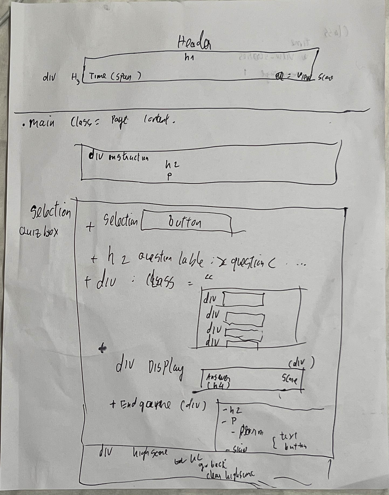
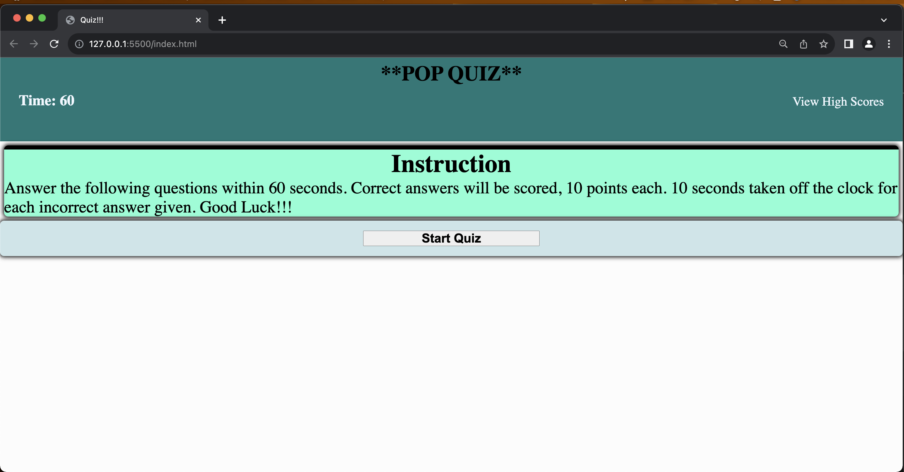
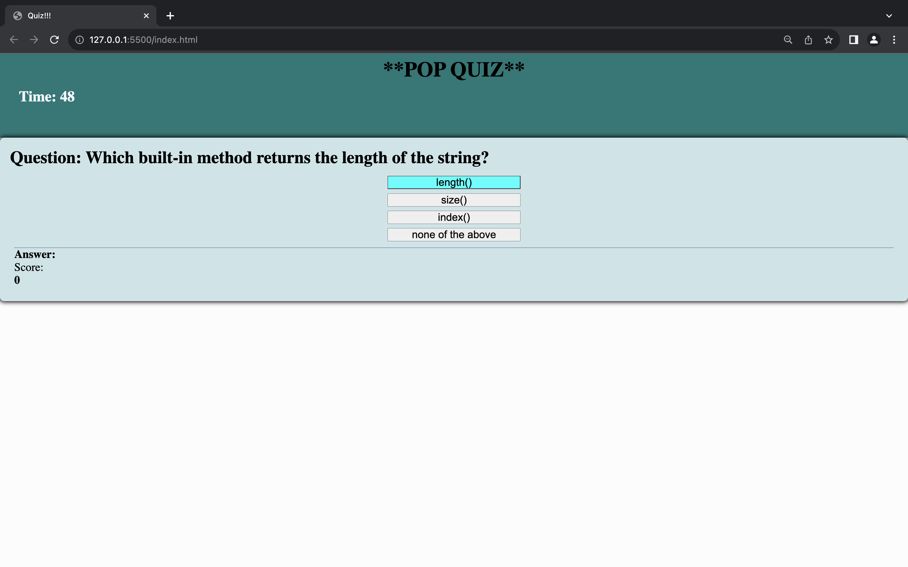
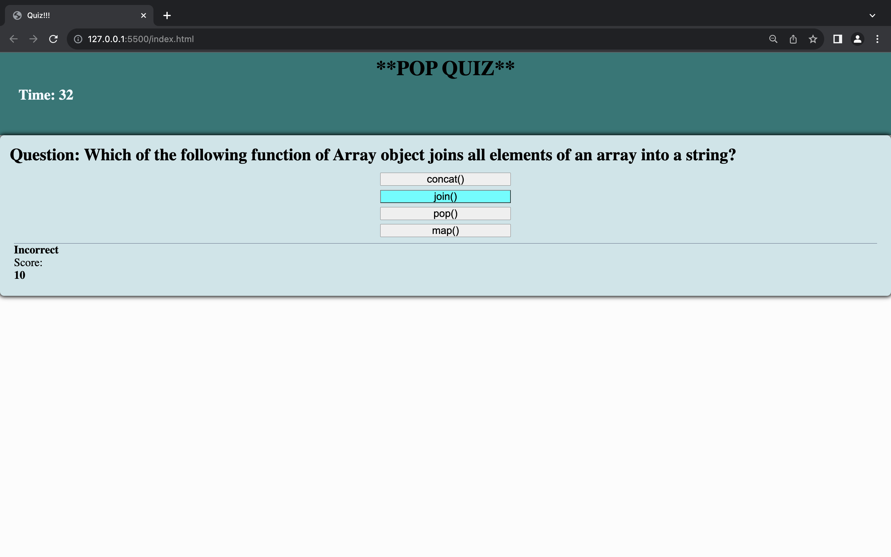
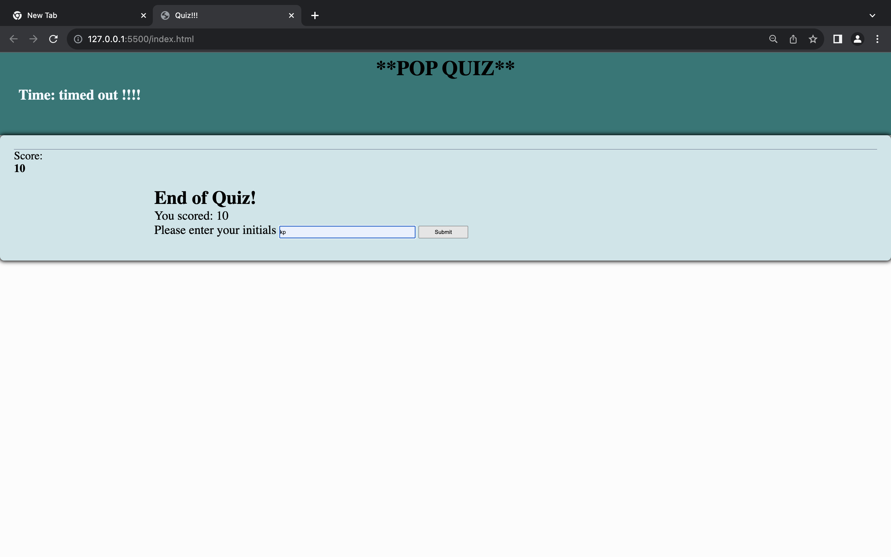
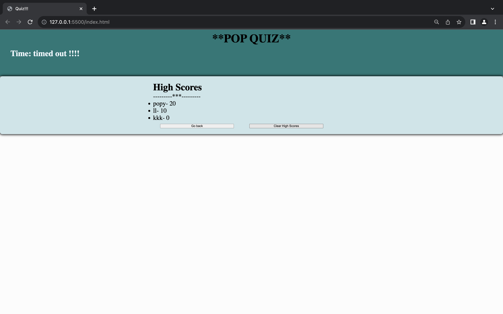

# Assignment #4: JavaScript, Code Quiz
User Story

AS A coding boot camp student
I WANT to take a timed quiz on JavaScript fundamentals that stores high scores
SO THAT I can gauge my progress compared to my peers

## Acceptance Criteria

GIVEN I am taking a code quiz
WHEN I click the start button
THEN a timer starts and I am presented with a question
WHEN I answer a question
THEN I am presented with another question
WHEN I answer a question incorrectly
THEN time is subtracted from the clock
WHEN all questions are answered or the timer reaches 0
THEN the game is over
WHEN the game is over
THEN I can save my initials and my score

## Summary

Using JavaScript, I created a JavaScript Code Quiz that must contain the following:

    Instructions on how the quiz plays
    User can click on the start button
    A timer starting when quiz begins
    The ability to loop thru multiple choice questions & answers
    Statement showing if answer chosen was right or wrong
    Time subtracted from incorrect answer selection
    The ability to save player initials & top scores
    The ability to clear high scores
    The ability to view high scores
    The ability to go back & retake quiz
    Game over presented when all questions answered OR timer runs out

### Languages
* HTML
* CSS
* JavaScript

## Usage
### User
* In order to run the application, click on the [link](https://khoiphan-9194.github.io/quiz/)
* Once you have been redirected to the web-page, there will be an instruction and  click on the start button
* Timer will be 60 seconds

## Accessories Used
### Languages
* HTML
* CSS
* JavaScript
Newly created index.html file with the following structure:

Newly created script.js file with the following:

    List of variables
    List of eventListeners
    List of functions

## Application Screenshot

## Links

* Deployed URL Link: https://github.com/khoiphan-9194/quiz
* GitHub Repository Link: https://khoiphan-9194.github.io/quiz/
