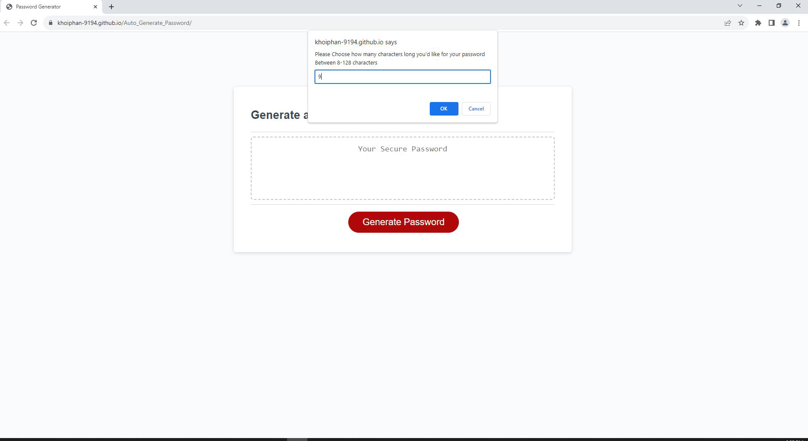

# Assignment #3: JavaScript, Password Generator

## Summary

Using JavaScript, I created a random password generator. For this assignment, I used: 

* Prompts that allow users to determine their preferred password length (on the condition that it is between 8 and 128 characters)

* Confirms that determine what types of characters they would like to use (lowercase letters, uppercase letters, numbers, and/or special characters).

* A function that would generate a password based on the information returned from these prompts and confirms.

* An "addEventListener" feature to the "Generate Password" button, so that the aforementioned prompts, confirms, and function would be initiated once the button was clicked.

## User Story

```
AS AN employee with access to sensitive data
I WANT to randomly generate a password that meets certain criteria
SO THAT I can create a strong password that provides greater security
```

## Acceptance Criteria

```
GIVEN I need a new, secure password
WHEN I click the button to generate a password
THEN I am presented with a series of prompts for password criteria
WHEN prompted for password criteria
THEN I select which criteria to include in the password
WHEN prompted for the length of the password
THEN I choose a length of at least 8 characters and no more than 128 characters
WHEN prompted for character types to include in the password
THEN I choose lowercase, uppercase, numeric, and/or special characters
WHEN I answer each prompt
THEN my input should be validated and at least one character type should be selected
WHEN all prompts are answered
THEN a password is generated that matches the selected criteria
WHEN the password is generated
THEN the password is either displayed in an alert or written to the page
```

## Usage
### User
* In order to run the application, click on the [link](https://khoiphan-9194.github.io/Auto_Generate_Password/)
* Once you have been redirected to the web-page, click on the "Generate Password" button
* You will be prompted with a series of questions regarding your password criteria (note, at least one must be selected, or else an error will pop up and the prompts will restart), including:
    * The desired password length (on the condition that it is between 8 and 128 characters long)
    * Whether you want the password to contain uppercase letters
    * Whether you want the password to contain lowercase letters
    * Whether you want the password to contain numbers
    * Whether you want the password to contain special characters
* When all prompts are answered, you will be provided with a password which is generated according to your responses


## Application Screenshot



## Accessories Used
### Languages
* HTML
* CSS
* JavaScript

## Links

* Deployed URL Link: https://khoiphan-9194.github.io/Auto_Generate_Password/
* GitHub Repository Link: https://github.com/khoiphan-9194/Auto_Generate_Password